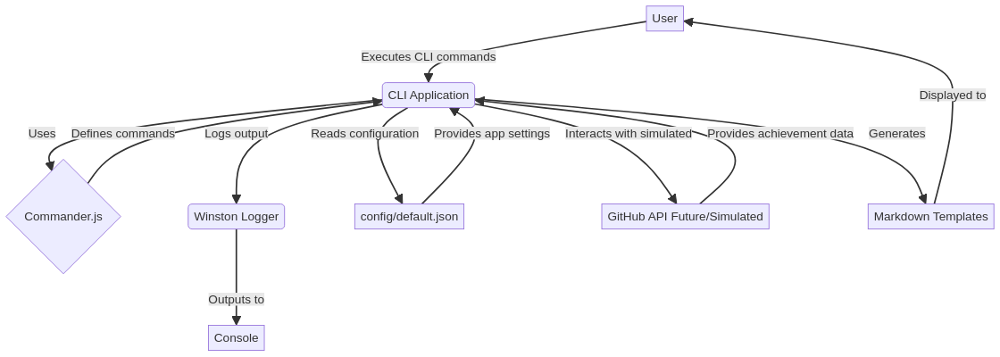

# GitHub Achievement Unlocker 🎯


An automated CLI tool and comprehensive strategy guide to unlock GitHub achievements and badges through legitimate contributions and activities.

[English Version](README.md) | [Versão em Português](docs/README_pt-br.md)

## Table of Contents

- [Introduction](#introduction)
- [Features](#features)
- [Screenshots](#screenshots)
- [Architecture](#architecture)
- [Installation](#installation)
- [Running Tests](#running-tests)
- [Usage](#usage)
- [Achievements List](#achievements-list)
- [Examples](#examples)
- [FAQ](#faq)
- [Troubleshooting](#troubleshooting)
- [API Documentation](#api-documentation)
- [Contributing](#contributing)
- [Changelog](#changelog)
- [License](#license)
- [Author](#author)

## Introduction

This project provides a command-line interface (CLI) tool designed to help developers understand and track their progress towards unlocking various GitHub achievements and badges. While GitHub does not provide a public API for achievements, this tool offers a simulated environment to explore the types of achievements available and track personal progress based on defined criteria. It encourages legitimate contributions and activities on GitHub, fostering a deeper engagement with the platform's features.

## Features

- **List Achievements:** Display a comprehensive list of known GitHub achievements and their requirements.
- **Simulated Achievement Check:** Simulate checking achievements for a given GitHub username (based on predefined logic).
- **Achievement Tracker Template:** Generate a Markdown template to manually track achievement progress.
- **Professional Structure:** Organized codebase with clear separation of concerns (src/, tests/, docs/, config/, public/).
- **Unit Tests:** Ensures code reliability and functionality.

## Screenshots

### CLI Output Example

```
$ npm start check galafis

Simulating achievement check for user: galafis
Simulated achievement check completed!

🎉 Achievements for galafis:
  📂 REPOSITORY:
    🏠 First Repository
    🌍 Public Repository
    ⭐ Starred Repository
  📂 CONTRIBUTIONS:
    📝 First Commit
    🔄 First Pull Request
    ✅ Pull Request Merged
    ⚡ Quickdraw
  📂 PACKAGES:
    📦 First Package
    🚀 Package Publisher
  📂 SPECIAL:
    🏔️ Arctic Code Vault Contributor
    💖 GitHub Sponsor
```

### List Achievements Command

```
$ npm start list

Available GitHub Achievements:
  🏠 First Repository
  🌍 Public Repository
  ⭐ Starred Repository
  📝 First Commit
  🔄 First Pull Request
  ✅ Pull Request Merged
  ⚡ Quickdraw
  📦 First Package
  🚀 Package Publisher
  🏔️ Arctic Code Vault Contributor
  💖 GitHub Sponsor
```

## Architecture

The `github-achievement-unlocker` is structured as a Node.js CLI application. Its architecture is designed for modularity and ease of maintenance:



**Components:**

- **CLI Application (src/index.js):** The core of the tool, handling command parsing and execution using `commander.js`.
- **Logger (src/logger.js):** Centralized logging utility using `winston` for consistent output and error handling.
- **Configuration (config/default.json):** Stores application settings, such as GitHub API endpoints and application metadata.
- **GitHub API (Simulated):** Currently, achievement checking is simulated due to the lack of a public GitHub API for achievements. This section is designed for future integration if an API becomes available.
- **Markdown Templates:** Used for generating achievement tracking templates.
- **Web Demo (public/):** Interactive web interface for achievement exploration.

## Installation

To get a local copy up and running, follow these simple steps.

### Prerequisites

- Node.js (v18.0.0 or higher)
- npm (v8.0.0 or higher)
- Git

### Clone the repository

```bash
git clone https://github.com/galafis/github-achievement-unlocker.git
cd github-achievement-unlocker
```

### Install dependencies

```bash
npm install
```

## Running Tests

To run the test suite and verify functionality:

```bash
# Run all tests
npm test

# Run tests in watch mode
npm test -- --watch

# Run tests with verbose output
npm test -- --verbose
```

The test suite includes unit tests for all core functionality and provides code coverage reports.

## Usage

### List all available achievements

```bash
npm start list
```

### Check achievements for a GitHub user (simulated)

This command simulates checking achievements for a given GitHub username and now provides a detailed list of unlocked achievements.

```bash
npm start check <username>
# Example:
npm start check galafis
npm start check octocat
```

**Example Output for `npm start check octocat`:**

```
Simulating achievement check for user: octocat
Simulated achievement check completed!

🎉 Achievements for octocat:
  📂 REPOSITORY:
    🏠 First Repository
    🌍 Public Repository
    ⭐ Starred Repository
  📂 CONTRIBUTIONS:
    📝 First Commit
    🔄 First Pull Request
    ✅ Pull Request Merged
    ⚡ Quickdraw
  📂 PACKAGES:
    📦 First Package
    🚀 Package Publisher
  📂 SPECIAL:
    🏔️ Arctic Code Vault Contributor
    💖 GitHub Sponsor
```

### Generate an achievement tracking Markdown template

```bash
npm start template
```

### Display package information

```bash
npm start info
```

## Achievements List

The following achievements are tracked and simulated by this tool:

| Category | Achievement Name | Description | Requirements | Badge |
| :-- | :-- | :-- | :-- | :-- |
| **Repository** | First Repository | Created your first repository | Create a public repository | 🏠 |
| | Public Repository | Made a repository public | Have a public repository | 🌍 |
| | Starred Repository | Starred a repository | Star any repository | ⭐ |
| **Contributions** | First Commit | Made your first commit | Make a commit to any repository | 📝 |
| | First Pull Request | Created your first pull request | Open a pull request | 🔄 |
| | Pull Request Merged | Had a pull request merged | Get a pull request merged | ✅ |
| | Quickdraw | Closed an issue or PR quickly | Close an issue/PR within 5 minutes | ⚡ |
| | YOLO | Merged a PR without review | Merge a PR without code review on default branch | 🎲 |
| | Pair Extraordinaire | Coauthored commits on merged PR | Coauthor a commit that gets merged | 👥 |
| **Package Publishing**| First Package | Published your first package | Publish a package to npm or GitHub Packages | 📦 |
| | Package Publisher | Regular package publisher | Publish multiple packages | 🚀 |
| **Special** | Arctic Code Vault Contributor | Contributed to the 2020 GitHub Archive Program | Had code archived in Arctic Code Vault | 🏔️ |
| | GitHub Sponsor | Sponsored another developer | Sponsor someone on GitHub Sponsors | 💖 |
| | Starstruck | Repository got many stars | Have a repository with 16+ stars (tiers at 16, 128, 512, 4096) | 🤩 |
| | Pull Shark | Opened multiple pull requests | Open 2+ pull requests (tiers at 2, 16, 128, 1024) | 🦈 |
| | Galaxy Brain | Answered discussions | Have 2+ accepted answers in discussions (tiers at 2, 8, 16, 32) | 🧠 |
| | Heart On Your Sleeve | Reacted with ❤️ emoji | React to something with a ❤️ emoji | ❤️ |

### Achievement Tiers

Many achievements have multiple tiers based on frequency:

- 🥉 **Bronze**: First tier (e.g., 2 PRs for Pull Shark)
- 🥈 **Silver**: Second tier (e.g., 16 PRs)
- 🥇 **Gold**: Third tier (e.g., 128 PRs)
- 💎 **Diamond**: Fourth tier (e.g., 1024 PRs)

## Examples

Check out the [examples directory](examples/) for detailed guides and use cases:

- **[Basic Usage](examples/basic-usage.md)** - Getting started with CLI commands
- **[Achievement Tracking](examples/achievement-tracking.md)** - Strategies to unlock achievements
- **Custom Scripts** - Automation and integration examples

Quick example:
```bash
# List all achievements
npm start list

# Check achievements for a user
npm start check octocat

# Generate tracking template
npm start template > MY_ACHIEVEMENTS.md
```

## FAQ

### How does achievement checking work?

Currently, the tool simulates achievement checking because GitHub doesn't provide a public API for achievements. The simulation is based on predefined logic for demonstration purposes.

### Can I use this tool with the real GitHub API?

The tool is designed to support real GitHub API integration in the future if GitHub releases an achievements API. Currently, it uses simulated data.

### How accurate are the achievement requirements?

The requirements are based on publicly available information about GitHub achievements. They may not be 100% accurate as GitHub doesn't officially document all achievement criteria.

### Is this tool affiliated with GitHub?

No, this is an independent open-source project created to help developers understand and track GitHub achievements.

### Can I contribute new achievements?

Yes! Please check the [Contributing Guide](docs/CONTRIBUTING.md) and submit a pull request with new achievement definitions.

### How often should I update the tool?

Check for updates regularly with `npm update @galafis/github-achievement-unlocker` to get the latest achievement definitions and features.

### Does this tool violate GitHub's Terms of Service?

No, this tool encourages legitimate contributions and activities. It doesn't automate actions or manipulate the GitHub platform.

## Troubleshooting

### Command not found error

**Problem:** Getting "command not found" when running npm start

**Solution:**
```bash
# Make sure you're in the correct directory
cd github-achievement-unlocker

# Reinstall dependencies
npm install

# Try running again
npm start list
```

### ESLint errors

**Problem:** Linting fails with errors

**Solution:**
```bash
# Fix automatically
npm run lint:fix

# Or check what needs fixing
npm run lint
```

### Tests failing

**Problem:** `npm test` shows failing tests

**Solution:**
```bash
# Clear cache and reinstall
npm run clean
npm install

# Run tests with verbose output
npm test -- --verbose
```

### Module not found error

**Problem:** Import errors or missing modules

**Solution:**
```bash
# Reinstall all dependencies
npm run reinstall
```

### Permission denied errors

**Problem:** Cannot execute commands or access files

**Solution:**
```bash
# Fix permissions (Linux/macOS)
chmod +x src/index.js

# Or run with node directly
node src/index.js list
```

## API Documentation

### Main Functions

#### `displayAchievements()`
Displays all available GitHub achievements with their requirements.

**Usage:**
```javascript
import { displayAchievements } from '@galafis/github-achievement-unlocker';
displayAchievements();
```

#### `checkUserAchievements(username)`
Simulates checking achievements for a GitHub user.

**Parameters:**
- `username` (string): GitHub username to check

**Returns:** Promise<Object> - Object containing unlocked achievements by category

**Usage:**
```javascript
import { checkUserAchievements } from '@galafis/github-achievement-unlocker';

const achievements = await checkUserAchievements('octocat');
console.log(achievements);
// { repository: ['First Repository', ...], contributions: [...], ... }
```

#### `generateTemplate()`
Generates a Markdown template for tracking achievements.

**Usage:**
```javascript
import { generateTemplate } from '@galafis/github-achievement-unlocker';
generateTemplate();
```

#### `displayInfo()`
Displays package information including version and author.

**Usage:**
```javascript
import { displayInfo } from '@galafis/github-achievement-unlocker';
displayInfo();
```

### ACHIEVEMENTS Object

Contains all achievement definitions organized by category.

**Structure:**
```javascript
{
  repository: {
    'Achievement Name': {
      description: 'Description of the achievement',
      requirements: 'Requirements to unlock',
      badge: '🏠'
    },
    // ...
  },
  contributions: { /* ... */ },
  packages: { /* ... */ },
  special: { /* ... */ }
}
```

**Usage:**
```javascript
import { ACHIEVEMENTS } from '@galafis/github-achievement-unlocker';

// Access specific achievement
const firstRepo = ACHIEVEMENTS.repository['First Repository'];
console.log(firstRepo.description);
```

## Changelog

See [CHANGELOG.md](CHANGELOG.md) for a detailed history of changes.

## Contributing

Contributions are what make the open source community such an amazing place to learn, inspire, and create. Any contributions you make are **greatly appreciated**.

1.  Fork the Project
2.  Create your Feature Branch (`git checkout -b feature/AmazingFeature`)
3.  Commit your Changes (`git commit -m 'Add some AmazingFeature'`)
4.  Push to the Branch (`git push origin feature/AmazingFeature`)
5.  Open a Pull Request

Please refer to [`CONTRIBUTING.md`](docs/CONTRIBUTING.md) for more details.

## License

Distributed under the MIT License. See [`LICENSE`](docs/LICENSE) for more information.

## Author

**Gabriel Demetrios Lafis** - [GitHub Profile](https://github.com/galafis)

*This README.md was generated and enhanced by Gabriel Demetrios Lafis.*
