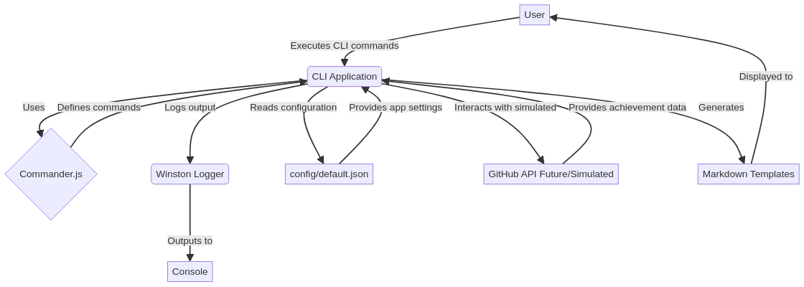

# GitHub Achievement Unlocker

   

Uma ferramenta automatizada e estratégias para desbloquear conquistas e selos do GitHub através de contribuições e atividades legítimas.

[English Version](../README.md) | [Versão em Português](README_pt-br.md)

## Sumário

- [Introdução](#introdução)
- [Funcionalidades](#funcionalidades)
- [Arquitetura](#arquitetura)
- [Instalação](#instalação)
- [Uso](#uso)
- [Lista de Conquistas](#lista-de-conquistas)
- [Contribuindo](#contribuindo)
- [Licença](#licença)
- [Autor](#autor)

## Introdução

Este projeto oferece uma ferramenta de interface de linha de comando (CLI) projetada para ajudar desenvolvedores a entender e acompanhar seu progresso em relação ao desbloqueio de várias conquistas e selos do GitHub. Embora o GitHub não forneça uma API pública para conquistas, esta ferramenta oferece um ambiente simulado para explorar os tipos de conquistas disponíveis e acompanhar o progresso pessoal com base em critérios definidos. Ela incentiva contribuições e atividades legítimas no GitHub, promovendo um engajamento mais profundo com os recursos da plataforma.

## Funcionalidades

- **Listar Conquistas:** Exibe uma lista abrangente de conquistas conhecidas do GitHub e seus requisitos.
- **Verificação Simulada de Conquistas:** Simula a verificação de conquistas para um determinado nome de usuário do GitHub (com base em lógica predefinida).
- **Modelo de Rastreador de Conquistas:** Gera um modelo Markdown para acompanhar manualmente o progresso das conquistas.
- **Estrutura Profissional:** Código organizado com clara separação de responsabilidades (src/, tests/, docs/, config/, public/).
- **Testes Unitários:** Garante a confiabilidade e funcionalidade do código.

## Arquitetura

O `github-achievement-unlocker` é estruturado como uma aplicação CLI Node.js. Sua arquitetura é projetada para modularidade e facilidade de manutenção:




**Componentes:**

- **Aplicação CLI (src/index.js):** O núcleo da ferramenta, responsável pela análise e execução de comandos usando `commander.js`.
- **Logger (src/logger.js):** Utilitário de log centralizado usando `winston` para saída consistente e tratamento de erros.
- **Configuração (config/default.json):** Armazena as configurações da aplicação, como endpoints da API do GitHub e metadados da aplicação.
- **API do GitHub (Simulada):** Atualmente, a verificação de conquistas é simulada devido à falta de uma API pública do GitHub para conquistas. Esta seção é projetada para futura integração, caso uma API se torne disponível.
- **Modelos Markdown:** Usados para gerar modelos de rastreamento de conquistas.

## Instalação

Para ter uma cópia local funcionando, siga estes passos simples.

### Pré-requisitos

- Node.js (v18.0.0 ou superior)
- npm (v8.0.0 ou superior)
- Git

### Clonar o repositório

```bash
git clone https://github.com/galafis/github-achievement-unlocker.git
cd github-achievement-unlocker
```

### Instalar dependências

```bash
npm install
```

## Uso

### Listar todas as conquistas disponíveis

```bash
npm start list
```

### Verificar conquistas para um usuário do GitHub (simulado)

```bash
npm start check <username>
# Exemplo:
npm start check galafis
npm start check octocat
```

### Gerar um modelo Markdown de rastreamento de conquistas

```bash
npm start template
```

### Exibir informações do pacote

```bash
npm start info
```

## Lista de Conquistas

As seguintes conquistas são rastreadas e simuladas por esta ferramenta:

| Categoria             | Nome da Conquista              | Descrição                                              | Requisitos                                           | Selo  |
| :-------------------- | :----------------------------- | :----------------------------------------------------- | :--------------------------------------------------- | :---- |
| **Repositório**       | Primeiro Repositório           | Criou seu primeiro repositório                         | Criar um repositório público                         | 🏠    |
|                       | Repositório Público            | Tornou um repositório público                          | Ter um repositório público                           | 🌍    |
|                       | Repositório Estrelado          | Deu estrela em um repositório                          | Dar estrela em qualquer repositório                  | ⭐    |
| **Contribuições**     | Primeiro Commit                | Fez seu primeiro commit                                | Fazer um commit em qualquer repositório              | 📝    |
|                       | Primeiro Pull Request          | Criou seu primeiro pull request                        | Abrir um pull request                                | 🔄    |
|                       | Pull Request Mesclado          | Teve um pull request mesclado                          | Ter um pull request mesclado                         | ✅    |
|                       | Quickdraw                      | Fechou uma issue ou pull request rapidamente           | Fechar uma issue/PR em 5 minutos                     | ⚡    |
| **Publicação de Pacotes**| Primeiro Pacote                | Publicou seu primeiro pacote                           | Publicar um pacote no npm ou GitHub Packages         | 📦    |
|                       | Publicador de Pacotes          | Publicador regular de pacotes                          | Publicar múltiplos pacotes                           | 🚀    |
| **Especiais**         | Contribuidor do Arctic Code Vault | Contribuiu para o Programa de Arquivo do GitHub de 2020 | Teve código arquivado no Arctic Code Vault           | 🏔️    |
|                       | Patrocinador do GitHub         | Patrocinou outro desenvolvedor                         | Patrocinar alguém no GitHub Sponsors                 | 💖    |

## Contribuindo

Contribuições são o que tornam a comunidade open source um lugar tão incrível para aprender, inspirar e criar. Quaisquer contribuições que você fizer são **muito apreciadas**.

1.  Faça um Fork do Projeto
2.  Crie sua Branch de Feature (`git checkout -b feature/AmazingFeature`)
3.  Faça Commit de suas Alterações (`git commit -m \'Adicione alguma AmazingFeature\' `)
4.  Envie para a Branch (`git push origin feature/AmazingFeature`)
5.  Abra um Pull Request

Consulte [`CONTRIBUTING.md`](docs/CONTRIBUTING.md) para mais detalhes.

## Licença

Distribuído sob a Licença MIT. Veja [`LICENSE`](docs/LICENSE) para mais informações.

## Autor

**Gabriel Demetrios Lafis** - [Perfil do GitHub](https://github.com/galafis)

---

*Este README.md foi gerado e aprimorado por Gabriel Demetrios Lafis.*
